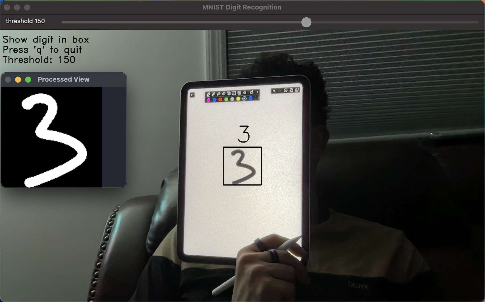
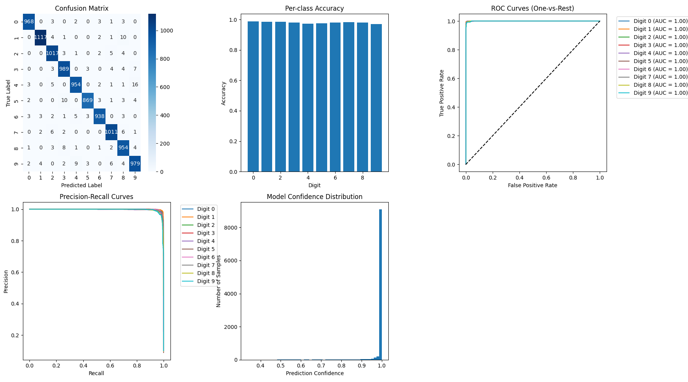

# MNIST Digit Classification

This Python project is a real-time handwritten digit recognition system that uses TensorFlow, OpenCV, and the MNIST dataset. The main goal is to classify digits from the MNIST dataset and make predictions on live video frames from a webcam.

The MNIST dataset, consisting of grayscale images of handwritten digits (0-9), is loaded and preprocessed for training. The dataset is normalized, and a simple neural network model is trained with an early stopping callback to prevent overfitting. The model consists of a flattened input layer, a hidden dense layer, and an output layer with softmax activation for multi-class classification. The model is optimized using the Adam optimizer and trained for up to 10 epochs.

Once trained, the model is used to predict digits from live video captured using OpenCV. The webcam feed is processed in real-time, with a thresholding slider that adjusts the binarization of the image, and a rectangular region of interest (ROI) that is passed to the trained model for prediction. The model’s prediction is overlaid on the video feed, showing the predicted digit. Users can toggle inference on and off with a mouse click.

In addition to the real-time classification, the project also generates several performance evaluation plots using matplotlib. These include confusion matrices, per-class accuracy, ROC curves, precision-recall curves, and a histogram of model prediction confidence. A classification report is also printed, providing a detailed analysis of the model's performance.

If a trained model is not available, the system will automatically train the model on the MNIST dataset, display the training accuracy and loss, and save the trained model for future use.

This project demonstrates the integration of machine learning with computer vision to create an interactive real-time application for digit recognition.

  

  

